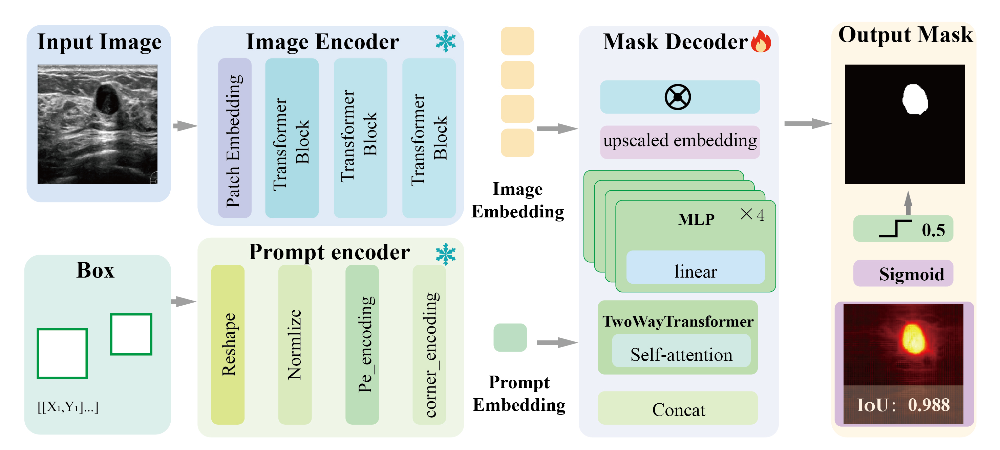
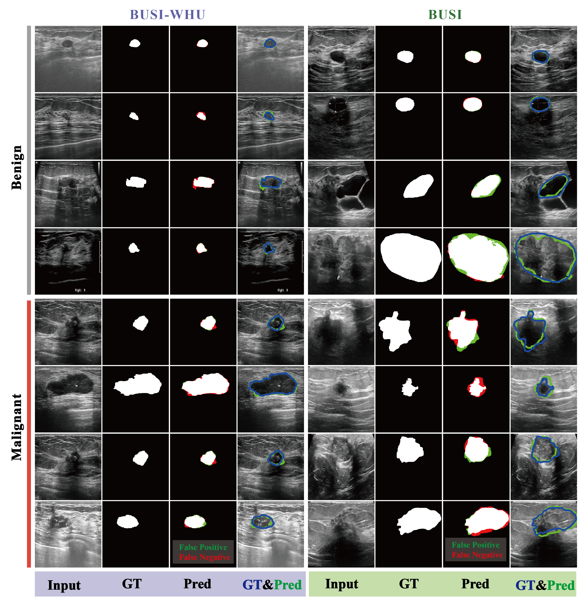
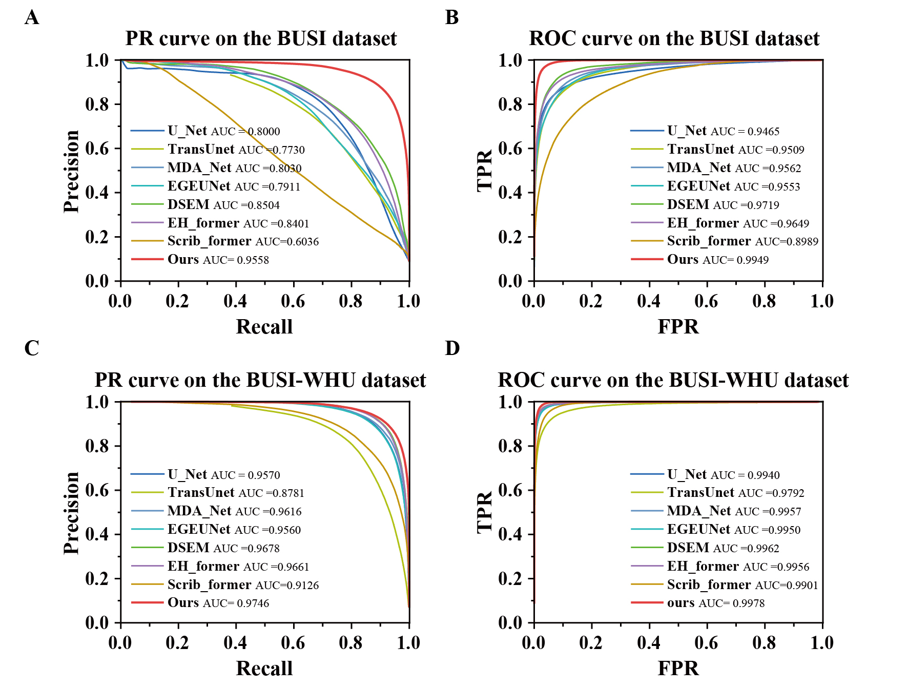
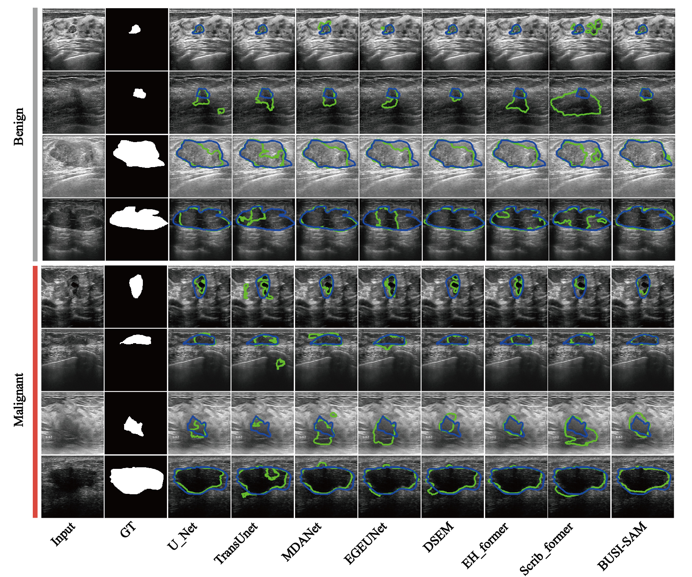

<h1 align="center">
  BUSI-SAM
</h1>

<p align="center">
  
  <br>
  <rm>Figure 1: BUSI_SAM Architecture</rm>
</p>

**📖Title：** Segment Anything for Breast Cancer Ultrasound Image

**👨‍💻Author：** Jin Huang, Yimin Zhang, Yujie Xie, Zhaoyi Ye, Jingwen Deng, Du Wang, Liye Mei, Cheng Lei

**Link：** [](https://github.com/huangjin520/BUSI_SAM)
 [Paper (coming soon)]()
[Project Website🔗](https://www.lei-whu.com)

**📜Abstract:** <p align="justify"> Breast ultrasound image segmentation is essential for accurate diagnosis, yet ultrasound images often have low resolution and poor signal-to-noise ratio, making abnormal lesions difficult to distinguish. Manual segmentation by doctors is also labor-intensive and time-consuming. Although the Segment Anything Model (SAM) shows strong zero-shot segmentation on natural images, it performs poorly on ultrasound images due to blurred boundaries, speckles, and diverse contrast. To address this, we propose BUSI-SAM, which fine-tunes SAM with breast ultrasound datasets and SA-1B pretrained weights. Experiments on the BUSI and BUSI-WHU datasets show that BUSI-SAM achieves superior performance, with mIoU of 89.29%, OA of 98.59%, and HD95 of 11.12 on BUSI, and mIoU of 90.96%, OA of 98.86%, and HD95 of 10.37 on BUSI-WHU. Precision-Recall and ROC curves also outperform other algorithms. These results indicate that BUSI-SAM effectively combines transfer learning and ultrasound fine-tuning, offering better segmentation performance and strong clinical potential in cancer diagnosis.


# Introduction
This is an official implementation of [Segment Anything for Breast Cancer Ultrasound Image](). ...


## 🚀 Quick start
### 1️⃣ Installation
Assuming that you have installed PyTorch and TorchVision, if not, please follow the [officiall instruction](https://pytorch.org/) to install them firstly. 
Intall the dependencies using cmd:

``` sh
python -m pip install -r requirements.txt --user -q
```

All experiments use the PyTorch 1.8 framework in a Python 3.10 environment. Other versions of pytorch and Python are not fully tested.
### 📂 Data preparation
We have evaluated segmentation performance on two public datasets [BUSI](https://www.sciencedirect.com/science/article/pii/S2352340919312181), [BUSI-WHU](https://data.mendeley.com/datasets/k6cpmwybk3/3). Please prepare the data as following:

``` sh
|-DATASET
  |-BUSI-WHU
    |-train
    | |-img
    | |-mask
    |-val
    | |-img
    | |-mask
    |-test
    | |-img
    | |-mask

```

### Training
The BUSI-SAM model can be trained on BUSI-WHU training set using the following: 

```
python train_BUSI_WHU.py 
``` 

The parameters of the model have been carefully designed. 

BUSI-SAM - Hardware: an NVIDIA RTX 3090 GPU and an Intel Core i9-10900X CPU.


## 📊 Evaluation
The BUSI-SAM model can be evaluated on BUSI-WHU validation set using the following: 

```
python eval.py 
``` 
<p align="center">
  
  <br>
  <rm> Figure: BUSI-SAM performance on the BUSI and BUSI-WHU datasets. In Pred columns, red (FP) and green (FN). In
GT&Pred columns, blue (GT) and green (prediction mask). </rm>
</p>

**Table**: The results (mean±std) of general segmentation algorithms on the BUSI dataset.  
The Top-2 results are in <span style="color:red">Red</span> and <span style="color:blue">Blue</span>.  
* indicates p < 0.01 (independent t-test). ↑: Higher is better. ↓: Lower is better.  

| Model | OA (%) ↑ | mRecall (%) ↑ | Kappa (%) ↑ | mIoU (%) ↑ | HD95 (pixels) ↓ |
|-------|----------|---------------|-------------|------------|-----------------|
| U-Net<sub>2015</sub> | <span style="color:blue">97.31 ± 0.692*</span> | 85.78 ± 2.454* | <span style="color:blue">76.08 ± 3.777*</span> | <span style="color:blue">80.29 ± 2.664*</span> | 32.03 ± 5.816* |
| TransUnet<sub>2021</sub> | 96.17 ± 0.650* | 85.07 ± 2.041* | 68.39 ± 3.731* | 75.23 ± 2.150* | 71.09 ± 7.715* |
| MDA-Net<sub>2022</sub> | 96.33 ± 0.649* | 83.76 ± 2.792* | 68.26 ± 6.837* | 75.32 ± 3.943* | 29.90 ± 5.910* |
| EGEUNet<sub>2023</sub> | 96.87 ± 0.870* | 80.33 ± 2.428* | 70.15 ± 4.258* | 76.43 ± 2.825* | <span style="color:blue">31.07 ± 5.530*</span> |
| DSEM<sub>2023</sub> | 96.27 ± 1.276* | <span style="color:blue">89.25 ± 1.303*</span> | 71.45 ± 9.188* | 77.34 ± 5.543* | 28.05 ± 6.911* |
| EH-former<sub>2024</sub> | 96.95 ± 0.562* | 86.42 ± 2.477* | 73.70 ± 4.950* | 78.72 ± 3.197* | 32.80 ± 6.105* |
| Scrib-former<sub>2024</sub> | 94.19 ± 0.934* | 75.41 ± 2.355* | 50.86 ± 3.433* | 65.50 ± 1.688* | 61.65 ± 3.735* |
| **BUSI-SAM** | <span style="color:red">98.59 ± 0.331</span> | <span style="color:red">95.09 ± 0.608</span> | <span style="color:red">88.15 ± 2.248</span> | <span style="color:red">89.29 ± 1.746</span> | <span style="color:red">11.12 ± 3.398</span> |


<p align="center">
  
  <br>
  <rm>Figure : PR and ROC curves of BUSI-SAM on BUSI and BUSI-WHU datasets. </rm>
</p>
**Table**: The results (mean±std) of general segmentation algorithms on the BUSI-WHU dataset.  
The Top-2 results are in <span style="color:red">Red</span> and <span style="color:blue">Blue</span>.  
* indicates p < 0.01 (independent t-test). ↑: Higher is better. ↓: Lower is better.  

| Model | OA (%) ↑ | mRecall (%) ↑ | Kappa (%) ↑ | mIoU (%) ↑ | HD95 (pixels) ↓ |
|-------|----------|---------------|-------------|------------|-----------------|
| U-Net<sub>2015</sub> | 98.52 ± 0.177* | 90.48 ± 1.104* | 86.52 ± 1.365* | 87.97 ± 1.120* | 19.33 ± 2.092* |
| TransUnet<sub>2021</sub> | 97.63 ± 0.303* | 86.93 ± 1.624* | 78.47 ± 2.299* | 81.93 ± 1.725* | 53.22 ± 4.147* |
| MDA-Net<sub>2022</sub> | 98.60 ± 0.152* | 92.33 ± 1.122* | 87.56 ± 1.306* | 88.80 ± 1.059* | 16.93 ± 5.840* |
| EGEUNet<sub>2023</sub> | 98.60 ± 0.179* | 91.83 ± 1.002* | 87.49 ± 1.147* | 88.74 ± 0.949* | 14.80 ± 2.094* |
| DSEM<sub>2023</sub> | 98.76 ± 0.118* | <span style="color:blue">93.58 ± 0.826*</span> | 89.18 ± 0.869* | 90.12 ± 0.726* | <span style="color:blue">13.87 ± 1.321*</span> |
| EH-former<sub>2024</sub> | <span style="color:blue">98.78 ± 0.117*</span> | 93.53 ± 0.859* | <span style="color:blue">89.30 ± 0.760*</span> | <span style="color:blue">90.22 ± 0.643*</span> | 13.89 ± 1.845* |
| Scrib-former<sub>2024</sub> | 97.63 ± 0.218* | 89.92 ± 1.118* | 79.75 ± 1.192* | 82.80 ± 0.858* | 23.93 ± 3.029* |
| **BUSI-SAM** | <span style="color:red">98.86 ± 0.103</span> | <span style="color:red">95.85 ± 0.573</span> | <span style="color:red">90.18 ± 0.646</span> | <span style="color:red">90.96 ± 0.547</span> | <span style="color:red">10.37 ± 0.578</span> |

<p align="center">
  
  <br>
  <rm>Figure : Visual comparison with different state-of-the-art methods on BUSI-WHU benign and malignant images. The blue
contour: GT; the green contour: predicted mask. </rm>
</p>


## 📜 Citation
If you find this work or code is helpful in your research, please cite:
### 📌 1. BUSI-SAM 
Coming soon...
### 📌 2. EMGANet (JBHI 2025)
EMGANet (JBHI 2025)[IEEE Xplore🔗](https://ieeexplore.ieee.org/document/10906450) [Github🔗](https://github.com/huangjin520/EMGANet) [Project Website🔗](https://www.lei-whu.com)
```
J. Huang et al., "EMGANet: Edge-Aware Multi-Scale Group-Mix Attention Network for Breast Cancer Ultrasound Image Segmentation," in IEEE Journal of Biomedical and Health Informatics, doi: 10.1109/JBHI.2025.3546345.
```

### 📌 3. DSATNet (Medical Physics 2025)
DSATNet (MP 2025)[Wiley 🔗](https://aapm.onlinelibrary.wiley.com/doi/10.1002/mp.17751) [Github🔗](https://github.com/Skylanding/DSATNet) [Project Website🔗](https://www.lei-whu.com)
```
Li Y, Huang J, Zhang Y, et al. Dual branch segment anything model‐transformer fusion network for accurate breast ultrasound image segmentation[J]. Medical Physics.
```
## 📬 Contact
For any questions or collaborations, please contact [Jin Huang](mailto:jinhuang@whu.edu.cn), [Yimin Zhang](mailto:rm002255@whu.edu.cn) [Yujie Xie](mailto:2023302082004@whu.edu.cn) or open an issue on GitHub.


****